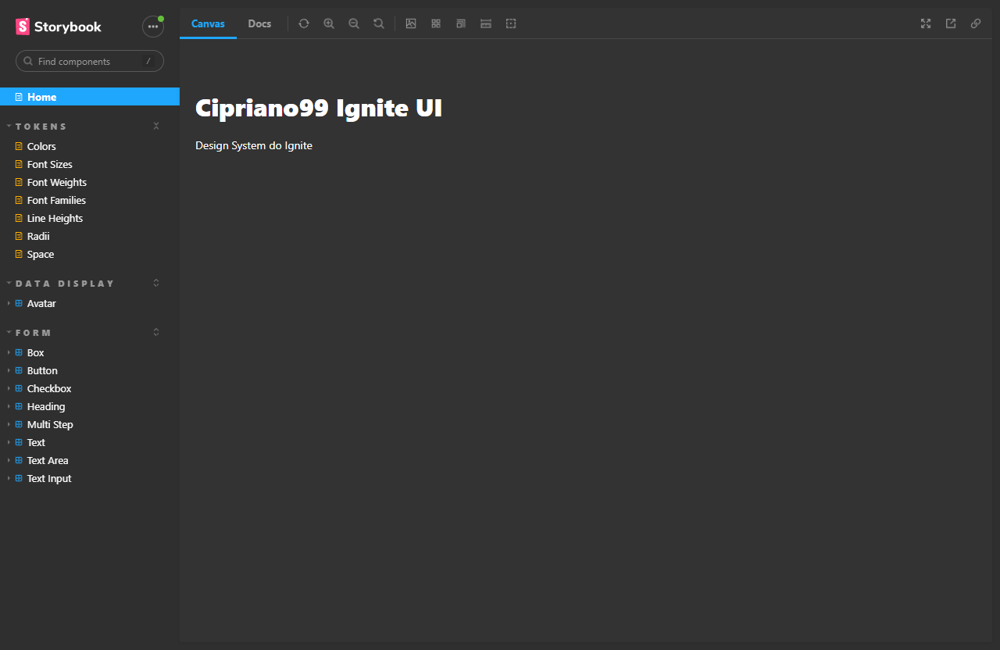
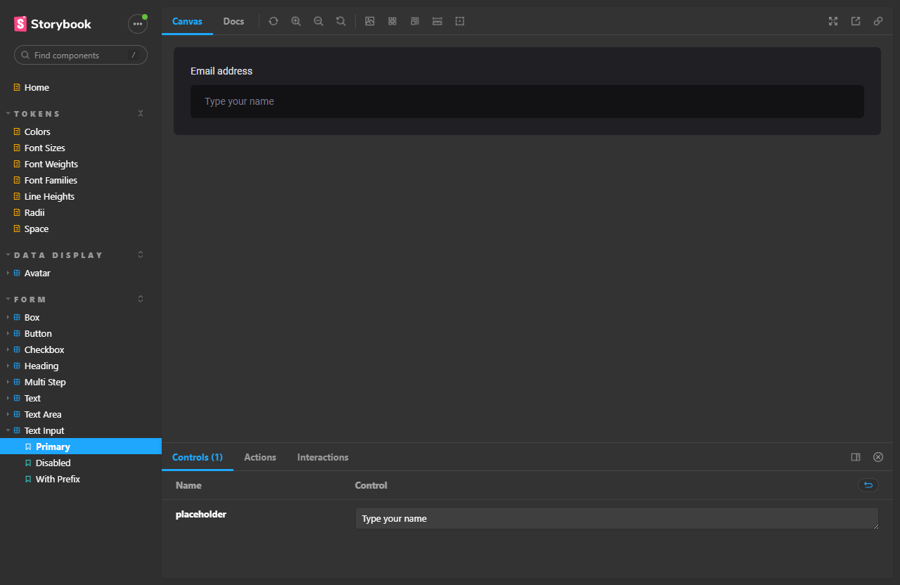
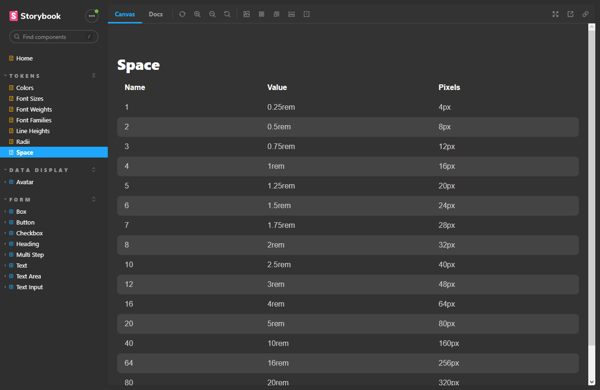

# 🔅 Cipriano Ignite UI

## Desafio de código!

Projeto desenvolvido durante a **Especialização no desenvolvimento Front-end** na [Rocketseat](https://www.rocketseat.com.br/).

## Sobre o projeto

Aplicação de um design system desenvolvida com Storybook, Vite, ReactJs, TypeScript, Stitches (CSS-in-JS), TurboRepo, Radix, CHangesets, entre outros.

## Funcionalidades

Nesta aplicação pode-se visualizar todos os componentes, valores de espaçamento e tamanho de fontes, bem como o style guide desenvolvido.

## Techs utilizadas

- [Vite](https://vitejs.dev)
- [Vite](https://react.dev)
- [TypeScript](https://www.typescriptlang.org/)
- [Stitches](https://stitches.dev/)
- [TURBOREPO](https://turbo.build)
- [Radix](https://www.radix-ui.com)
- [Git](https://git-scm.com/)
- CI/CD Github Actions

## Acesse
[Cipriano99-ignite-ui](https://cipriano99.github.io/ignite-design-system/?path=/story/home--page)

## Telas da aplicação

- Tela inicial
  

- Input
  

- Espaçamentos
  
  